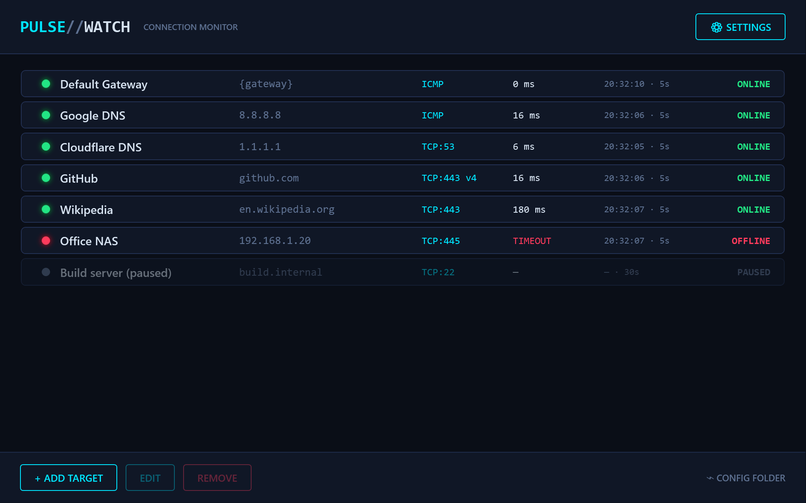
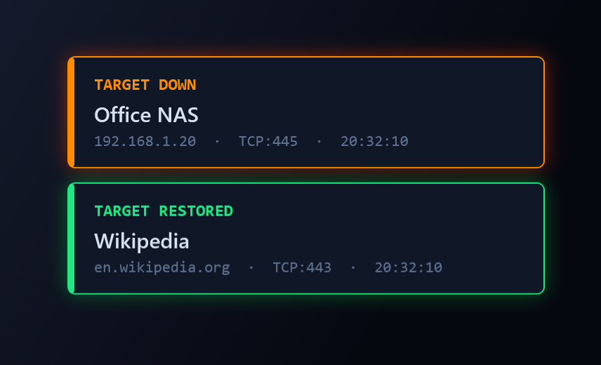
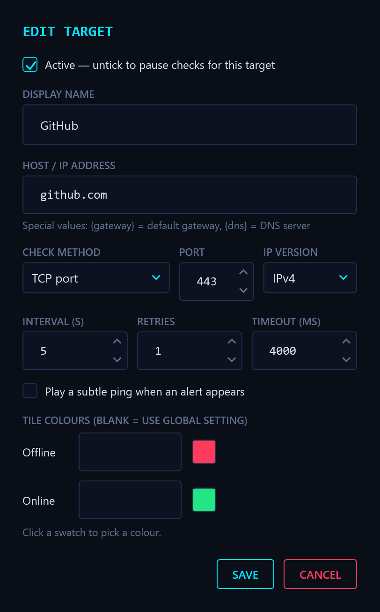
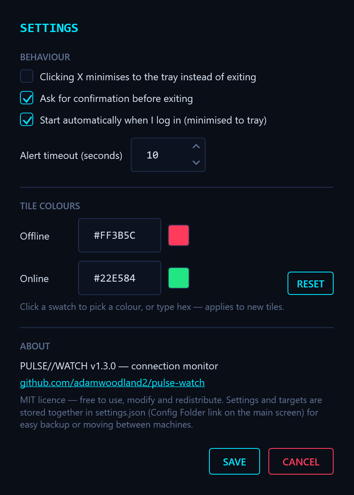

# PULSE//WATCH

WPF (.NET 8) connection monitor for Windows. Checks hosts/IPs by ICMP ping or TCP port on a per-target interval and pops slide-in alert tiles at the screen edge when a target goes down (red) or recovers (green). Runs from the tray.



Alert tiles slide in at the screen edge and dismiss themselves (this one uses a per-target orange override for "down"):



<p>
  
  
</p>

## Getting started

Windows 10/11. To build you need the .NET 8 SDK (`winget install Microsoft.DotNet.SDK.8`); `build.ps1` finds it even if your terminal's PATH predates the install.

```
.\build.ps1 -SelfContained         # x64, portable single exe (~150 MB), no .NET needed on the target  -> dist\
.\build.ps1                        # x64, smaller exe; target needs the .NET 8 Desktop Runtime          -> dist\
.\build.ps1 -Arm64                 # Windows on ARM (add -SelfContained for a portable exe)             -> dist-arm64\
.\build.ps1 -DebugBuild            # Debug build only (or just `dotnet run` while developing)
```

Then run `dist\PulseWatch.exe`. A fresh install seeds two starter targets (Google DNS and your default gateway); tick **Start automatically when I log in** in Settings to have it launch minimised at login.

## Command line

- `--minimized` (or `/min`) — start hidden in the tray; monitoring and alerts run as normal.
- `--monitor N` (also `--monitor=N`, `/monitor:2`) — show alert tiles on screen N (1-based, as listed by Windows). Invalid/missing N falls back to the primary screen.
- `--settings <file>` (also `--settings=<file>`) — use a different settings file instead of `%APPDATA%\PulseWatch\settings.json`, e.g. for a separate profile or a portable copy.

Only one instance runs per user; a second launch shows a notice and exits.

## Targets

Each target has: name, address, check method (TCP port / ICMP ping), IP version, interval, retries, timeout, active flag, optional alert sound, optional tile colours.

**Address** can be a hostname, an IPv4/IPv6 literal, a pasted URL (the host is extracted), or a token:

| Token | Resolves to (re-evaluated every check, so switching networks is picked up) |
|---|---|
| `{gateway}` | the default gateway |
| `{dns}` | the first DNS server |

**IP version** controls which address family is probed. Default is Auto, which behaves as the app always has:

| IP version | Hostname | IP literal | `{gateway}` / `{dns}` |
|---|---|---|---|
| **Auto** | TCP: resolves A+AAAA and races candidates, IPv6 first (see below); whichever connects wins. ICMP: whatever the OS resolver lists first (usually IPv6 if there is an AAAA). | that family | IPv4 if present, else IPv6 |
| **IPv4** | A records only | must be IPv4, else `NO V4` | the IPv4 gateway/DNS, else `NO V4` |
| **IPv6** | AAAA records only | must be IPv6, else `NO V6` | the IPv6 gateway/DNS (usually link-local `fe80::…`), else `NO V6` |

A forced-family row is the way to watch one path explicitly — e.g. two rows, "Gmail v4" and "Gmail v6", make an IPv6 blackhole visible instead of hidden behind fallback. The list shows the family on forced rows (`TCP:443 v6`, `ICMP v4`).

## How checks work

**Scheduling.** Each active target runs its own loop on its interval. Loops start with a random 0.2–8 s offset so many targets don't fire in a synchronized burst every interval. A target is declared offline only after the check fails *and* the configured retries (default 1, spaced 1 s apart) also fail; one success flips it back online immediately. The per-target timeout (default 4000 ms) bounds the whole check, DNS included.

**TCP checks.** A probe is a plain TCP connect to the port — no data is sent.
- *Sticky route:* the address that connected last time is remembered (5 min) and steady-state checks open exactly one socket to it, with no DNS query.
- *Race on failure / first check / expiry:* the name is resolved and up to 4 candidate addresses are tried, IPv6/IPv4 interleaved with a 300 ms stagger; the first to connect wins and becomes the sticky route. This stops one dead CDN address (listed first in DNS) from burning the whole timeout even though the host is fine; the race cancels the losers as soon as one connects. The target's IP version setting decides which addresses are eligible.
- *Socket close:* probe sockets are closed abortively (RST, `SO_LINGER` = 0) rather than with a FIN handshake. Because no data was exchanged there is nothing to flush, and a graceful close would leave one `TIME_WAIT` entry per check on the machine for 30–120 s.

**ICMP checks.** One echo request with a 32-byte payload (the .NET/Windows `ping` default) per check. Auto lets the OS choose the family; IPv4/IPv6 resolve the name and ping the first address of that family. Pings use the synchronous API on a pool thread on purpose — the async one leaks a kernel handle per call on Windows.

**Failure codes** (shown in the latency column while a target is down):

| Code | Meaning |
|---|---|
| `TIMEOUT` | no reply / handshake within the timeout |
| `REFUSED` | host answered but the port is closed (host is alive) |
| `DNS` | name did not resolve |
| `UNREACH` | network/host unreachable (a router said no route) |
| `RESET` / `TTL` / `FAIL` | connection reset / TTL expired / other |
| `NO V4` / `NO V6` | forced family, but the target has no address of that family |
| `NO NET` | a `{gateway}`/`{dns}` token has no address right now |

## Alerts and the tray

- Tiles slide in at the right edge of the chosen screen in a small always-on-top overlay that exists only while tiles are showing and is sized to them — nothing sits over your desktop or games the rest of the time. They appear even when the app is minimised, never steal focus, and dismiss on click, after the alert timeout (default 10 s), or automatically when a downed target recovers. Alerts fire only on state transitions, not on every failed check.
- A subtle two-note ping plays with each tile (per-target setting; falling for down, rising for recovery).
- Tray icon: cyan ring when all active targets are up, red ring while any is offline; the tooltip shows the version and offline count. Right-click for Open, Mute alert sounds, Suppress tiles (off / until re-enabled / 1 m / 5 m / 15 m / 30 m / 1 h / 12 h — monitoring continues, only tiles are held), Exit.
- Minimising hides to the tray; with "X minimises to tray" on, closing does too.

## Settings

⚙ SETTINGS: X-minimises-to-tray, confirm-before-exit, auto-start at login (minimised), alert timeout, global tile colours (with picker), version/GitHub/licence. Everything — settings and targets — lives in one JSON file, `%APPDATA%\PulseWatch\settings.json` by default (Config Folder link on the main screen) or whatever `--settings` points at, for easy backup or moving between machines. Auto-start is the one setting kept in the registry instead, since it embeds the exe path.

Loading is defensive: out-of-range numbers are clamped, invalid colours reset, duplicate target IDs regenerated, and an unreadable file is preserved as `settings.json.corrupt` with a warning. Saves are atomic.

## Licence

MIT — see `LICENSE`.
